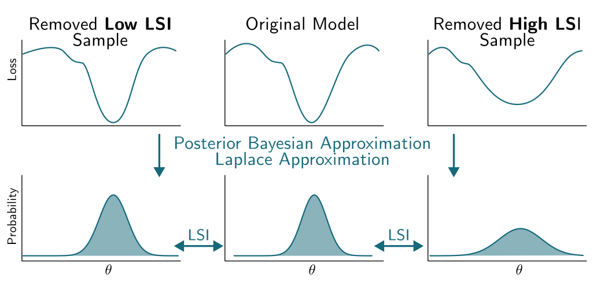
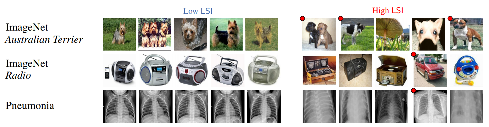

# Laplace Sample Information (LSI)

This project introduces **Laplace Sample Information (LSI)**, a novel measure of sample informativeness grounded in information theory. LSI leverages a Bayesian approximation to the weight posterior and the Kullback-Leibler (KL) divergence to quantify the unique contribution of individual samples to the parameters of a neural network.


LSI fits a Bayesian posterior to the model using the Laplace approximation. By performing Leave-One-Out (LOO) retraining of the last layer, we can probe the features of the model and compute the Kullback-Leibler (KL) divergence between the posterior distributions with and without a specific data point. This KL divergence quantifies the informativeness of the data point.

<div align="center">
    
</div>

Theoretically, LSI locally approximates an upper bound of the pointwise conditional mutual information between a data point and the weights of a neural network. The formula for LSI is given as:

$$
\text{LSI}(z_i, A, D^{-i}) \triangleq \mathsf{KL}(\mathcal{N}(\hat{\theta}, \Sigma) || \mathcal{N}(\hat{\theta}^{-i}, \Sigma^{-i}))
$$

which has a closed form solution as:

$$
\text{LSI}(z_i, A, D^{-i}) = 
\frac{1}{2} \left[\mathrm{tr}((\Sigma^{-i})^{-1} \Sigma) - K
+ (\hat{\theta}^{-i} - \hat{\theta})^{T} (\Sigma^{-i})^{-1} (\hat{\theta}^{-i} - \hat{\theta}) + \ln \left(\frac{\det (\Sigma^{-i})}{\Sigma}\right)\right]
$$

---

## Key Features
- **Sample Informativeness**: LSI identifies typical and atypical samples, detects mislabeled data, and measures class-wise informativeness.
- **Dataset Analysis**: It assesses dataset difficulty and provides insights into data quality and informativeness.
- **Efficiency**: LSI can be computed efficiently using a probe model, enabling scalability to large datasets and architectures, without putting any constraints on the architectures.
- **Broad Applicability**: LSI is applicable across supervised and unsupervised tasks of any modality.



---

## Applications
- Dataset curation and condensation
- Identifying mislabeled or redundant samples
- Measuring class-wise and dataset-level informativeness
- Improving model efficiency and generalization
- ...

---

## Getting Started
To get started, clone the repository and set up the uv environment:

```bash
git clone <repository-url>
python -m venv uv
source uv/bin/activate  # On Windows use `uv\Scripts\activate`

```

```bash
cd LSI
export PYTHONPATH=$PYTHONPATH:$(pwd)
```

### Replicating Experiments

To compute LSI values for various scenarios, use the following commands:

#### 1. Compute LSI on CIFAR-10
```bash
python .LSI/experiments/LSI_compute.py --dataset cifar10
```

#### 2. Compute LSI on CIFAR-100
```bash
python .LSI/experiments/LSI_compute.py --dataset cifar100
```

#### 3. Compute LSI with Label Noise
```bash
python .LSI/experiments/LSI_compute.py --dataset cifar10 --corrupt_label 0.2
```

#### 4. Compute LSI with Data Noise (on labels 0, 1, 2)
```bash
python .LSI/experiments/LSI_compute.py --dataset cifar10 --corrupt_data 0.1 --corrupt_data_label 0 1 2
```

#### 5. Compute LSI with Humanly Mislabeled Data
```bash
python .LSI/experiments/LSI_compute.py --dataset cifar10 --human_label_noise True
```
